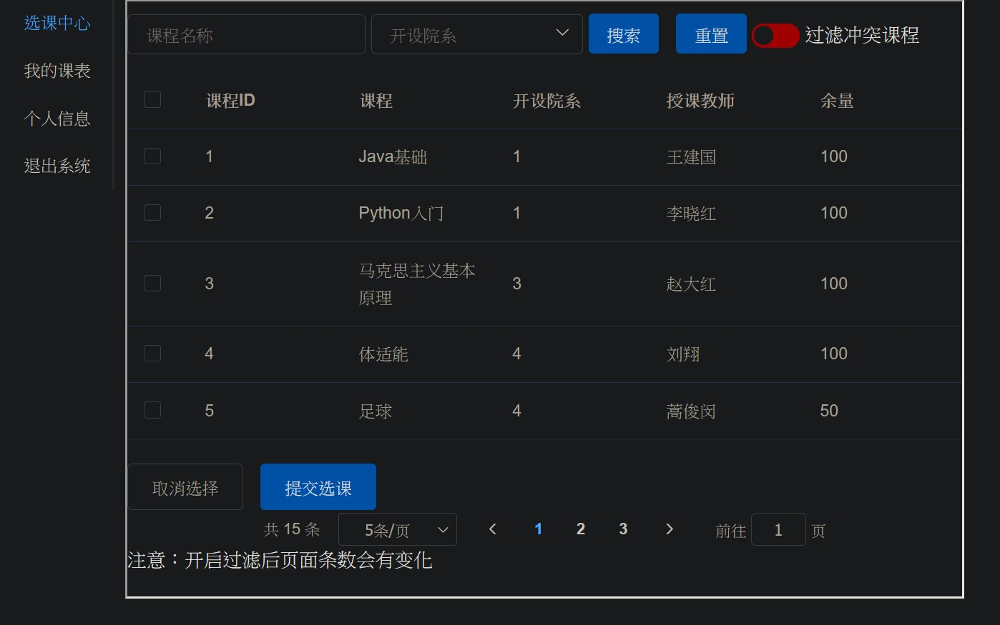
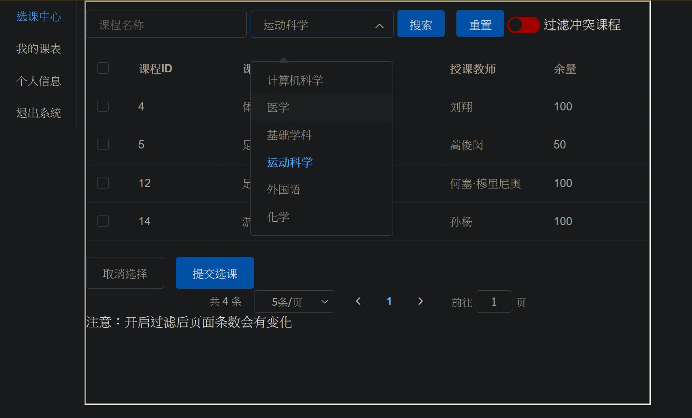
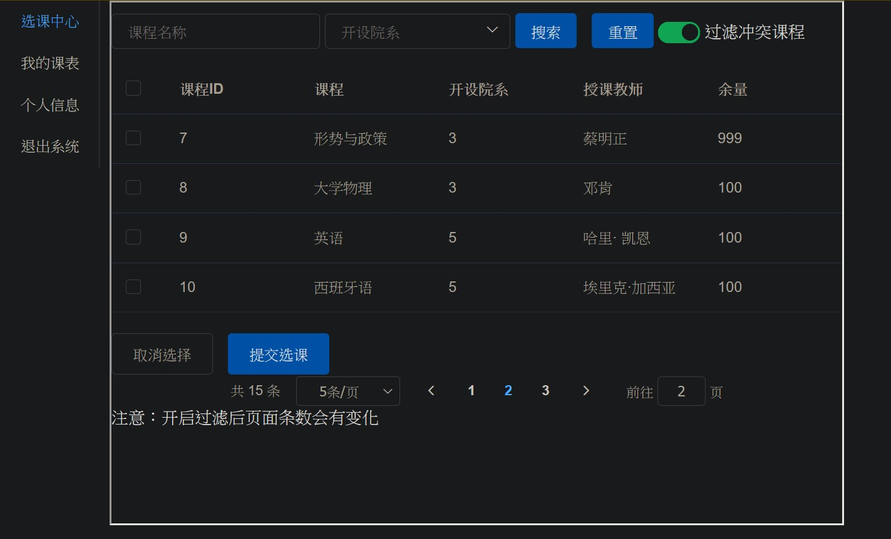
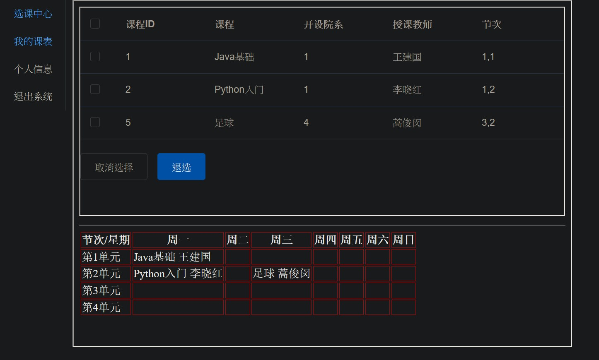
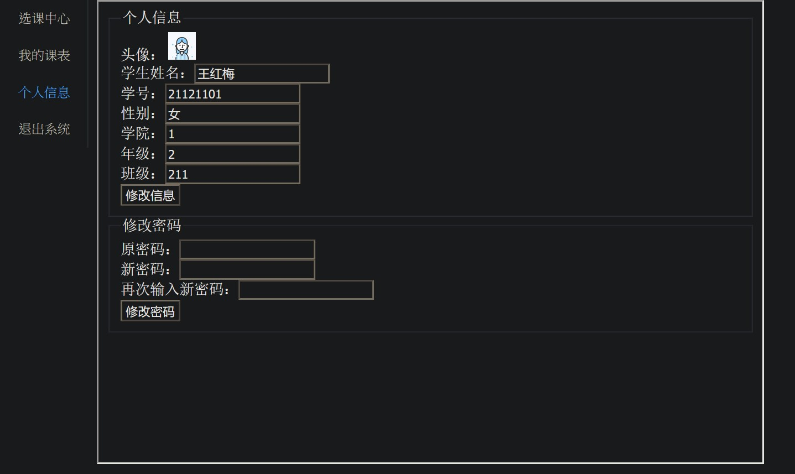

“简易学生选课系统” 说明

模块
    
    用户模块：信息修改
            课程的增、删、改、查
    学生模块：个人信息修改
            上传附件（文件系统存储）
            选课：浏览已选课程
                过滤冲突课程（集合Stream）
                课程表模式（二维数组）
    课程模块：课程增、删、改、查API
    登录拦截器：检查请求头token参数并验证

前端

    vue2.0 + 3.0混用 html + element UI 混用
    前后端分离模式
    采用jwt token登录验证

    后续会用react重写

技术

    SSM（Spring、SpringMVC、Mybatis Plus）采用注解配置类方式整合
    现在已经升级为SpringBoot
    MP相较于Mybatis效率有所提升，保留mapper.xml，方便多表查询
    多表SQL采用SpringDataJPA的模式编写，即嵌套查询模式
    
    后续添加：
    Redis：用于查询缓存、请求缓存
    RabbitMQ ：流量削峰

极其简陋的东西，请勿嘲笑！

版权所有 (c)2022